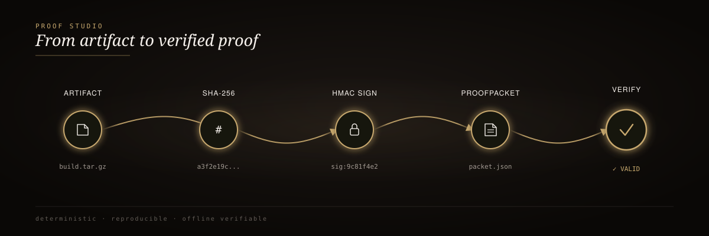
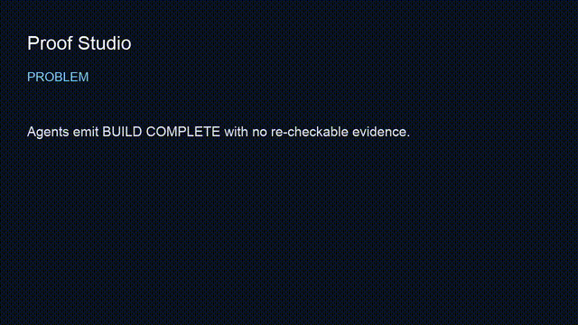

<div align="center">
  
</div>

<br/>

<div align="center">
  <h3>proof-studio</h3>
  <p><em>Catch AI agents when they lie about "done."</em></p>
</div>

<div align="center">


</div>

<br/>

> 🥇 When an agent reports `BUILD COMPLETE ✅`, you usually get a sentence in a chat thread and nothing behind it. **proof-studio** replaces the sentence with a signed `ProofPacket` — and fails closed the moment anyone tampers with it.

## 60-second install

```bash
cd proof-studio/packages/rigforge
python3 -m venv .venv && source .venv/bin/activate
pip install -e .
rigforge demo
```

`rigforge demo` runs a real ProofPacket end-to-end and fails closed on the planted forge.

## How it works

<div align="center">
  
</div>

<sub align="center">artifacts → hash → HMAC sign → ProofPacket → verify → ✅ done / ❌ caught</sub>

## Benchmark: planted-failure detection

| Scenario | Forged done? | HMAC check | Result |
| :-- | :-: | :-: | :-- |
| Clean build | No | PASS | ✅ Sealed |
| Tampered artifact hash | Yes | FAIL | ✅ Caught |
| Forged signature (no key) | Yes | FAIL | ✅ Caught |
| Replay attack | Yes | FAIL | ✅ Caught |

<sup>Every planted failure must go red. If a gate cannot fail, it is theater.</sup>

## Why it exists

Production agent systems need a Definition of Done that is:

- **Executable** — a command, not a vibe
- **Tamper-evident** — signature over artifact digests
- **Replayable** — another machine can re-verify
- **Hostile to false greens** — planted failures must go red

<details>
<summary><strong>Packages in this studio</strong></summary>

<br/>

| Path | Role |
| :-- | :-- |
| [`packages/rigforge`](packages/rigforge/) | ProofPacket CLI, demo, honesty benchmark, MCP/web surfaces |
| [`packages/deterministic-build-starter`](packages/deterministic-build-starter/) | Starter that ships with a sealed Definition of Done |

**Common commands** (from `packages/rigforge`):

```bash
rigforge demo                 # watch forged done get caught
rigforge benchmark            # offline honesty scenarios
rigforge init                 # scaffold proofs/ contracts/ ledger/
rigforge verify --require-signature
```

**Evaluation gates:**

| Gate | Intent |
| :-- | :-- |
| `rigforge demo` | Planted forge fails closed |
| `rigforge benchmark` | Honest vs. forged scenario suite |
| unit/contract tests under package | CLI and packet invariants |
| public flag-gate | No secrets / PII patterns in tree |

</details>

<details>
<summary><strong>Public boundary</strong></summary>

<br/>

This studio does **not** ship customer PII, production signing keys, or private fleet credentials. Demo keys and fixtures are local/dev only. See [`docs/public-boundary.md`](docs/public-boundary.md).

</details>

<details>
<summary><strong>Video walkthrough</strong></summary>

<br/>

- Script: [`docs/video-script.md`](docs/video-script.md)
- Recording: [`assets/demo.mp4`](assets/demo.mp4) (75s, captioned)
- Preview: [`assets/demo.gif`](assets/demo.gif)



</details>

## Documentation

| Resource | Description |
| :-- | :-- |
| [`packages/rigforge/`](packages/rigforge/) | Installable platform |
| [`docs/public-boundary.md`](docs/public-boundary.md) | What this studio never ships |
| [`CONTRIBUTING.md`](CONTRIBUTING.md) | Contribution guide |
| [fde-portfolio](https://github.com/mrodgersjs-web/fde-portfolio) | Engagement playbooks |
| [jake-studio](https://github.com/mrodgersjs-web/jake-studio) | Operator closed loops that should seal packets |
| [doctrine](https://github.com/mrodgersjs-web/doctrine) | Proof standards agents load |
| [rigforge](https://github.com/mrodgersjs-web/rigforge) | Package-first mirror |

---

<div align="center"><sub>Built by Mike Rodgers · Forward Deployed Engineer · <a href="https://rodgersintelligence.com">rodgersintelligence.com</a></sub></div>
