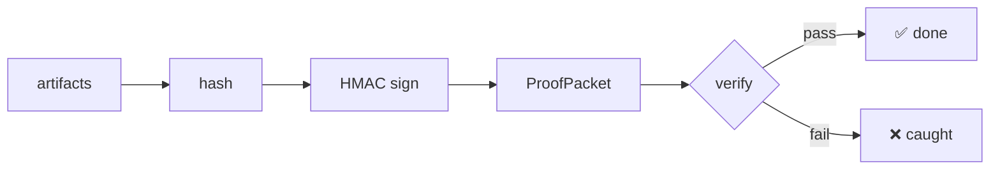

# proof-studio

**Catch AI agents when they lie about "done" — signed ProofPackets make completion claims re-verifiable.**


## 60-second install

```bash
cd proof-studio/packages/rigforge
python3 -m venv .venv && source .venv/bin/activate
pip install -e .
rigforge demo
```

`rigforge demo` runs a real ProofPacket end-to-end and fails closed on the planted forge.

## Benchmark: planted-failure detection

| Scenario | Forged done? | HMAC check | Result |
| --- | --- | --- | --- |
| Clean build | No | PASS | ✅ Sealed |
| Tampered artifact hash | Yes | FAIL | ✅ Caught |
| Forged signature (no key) | Yes | FAIL | ✅ Caught |
| Replay attack | Yes | FAIL | ✅ Caught |

Every planted failure must go red. If a gate cannot fail, it is theater.

## Why it exists

Production agent systems need a Definition of Done that is:

- **executable** — a command, not a vibe
- **tamper-evident** — signature over artifact digests
- **replayable** — another machine can re-verify
- **hostile to false greens** — planted failures must go red

## Architecture



## Learn

Made-With-Proof notebooks (coming):

1. `01-why-gates` — why a gate that cannot fail is theater
2. `02-first-proofpacket` — seal and verify your first packet
3. `03-planted-failures` — tamper, forge, replay, and watch them go red
4. `04-production-handoff` — wiring ProofPackets into CI/CD

## Contributing

See [`CONTRIBUTING.md`](CONTRIBUTING.md).

## License

MIT.

---

## Employer summary

AI coding agents are fast and confident. That confidence is the risk.

When an agent reports `BUILD COMPLETE ✅`, you usually have a sentence in a chat thread and nothing behind it. **proof-studio** replaces the sentence with a signed `ProofPacket`: artifact hashes, environment record, HMAC signature. Tamper the result and re-forge the hash — the signature still fails if you never had the key.

This is the FDE posture applied to agent work itself: **no proof, no done.**

### Review path

1. This README
2. 60-second demo above
3. [`packages/rigforge/`](packages/rigforge/) — installable platform
4. [`docs/public-boundary.md`](docs/public-boundary.md)
5. Sibling package surface: [`rigforge`](https://github.com/mrodgersjs-web/rigforge)

## Packages

| Path | Role |
| --- | --- |
| [`packages/rigforge`](packages/rigforge/) | ProofPacket CLI, demo, honesty benchmark, MCP/web surfaces |
| [`packages/deterministic-build-starter`](packages/deterministic-build-starter/) | Starter that ships with a sealed Definition of Done |

### Common commands (from `packages/rigforge`)

```bash
rigforge demo                 # watch forged done get caught
rigforge benchmark            # offline honesty scenarios
rigforge init                 # scaffold proofs/ contracts/ ledger/
rigforge verify --require-signature
```

## Evaluation / gates

| Gate | Intent |
| --- | --- |
| `rigforge demo` | Planted forge fails closed |
| `rigforge benchmark` | Honest vs forged scenario suite |
| unit/contract tests under package | CLI and packet invariants |
| public flag-gate | no secrets / PII patterns in tree |

## Public boundary

This studio does **not** ship customer PII, production signing keys, or private fleet credentials.  
Demo keys and fixtures are local/dev only. See [`docs/public-boundary.md`](docs/public-boundary.md).

## Video walkthrough

- Script: [`docs/video-script.md`](docs/video-script.md)
- Recording: [`assets/demo.mp4`](assets/demo.mp4) (75s captioned)
- Preview: [`assets/demo.gif`](assets/demo.gif)


## Related studios

- [fde-portfolio](https://github.com/mrodgersjs-web/fde-portfolio) — engagement playbooks
- [jake-studio](https://github.com/mrodgersjs-web/jake-studio) — operator closed loops that should seal packets
- [doctrine](https://github.com/mrodgersjs-web/doctrine) — proof standards agents load
- [rigforge](https://github.com/mrodgersjs-web/rigforge) — package-first mirror

## FDE bar (this studio)

| Practice | Here |
| --- | --- |
| Employer summary | top of README |
| 60s / smoke proof | fde-portfolio smoke PASS |
| Public boundary | documented |
| Claim under test | `"rigforge demo catches forged done"` |
| Related fleet | [profile](https://github.com/mrodgersjs-web) · [resume](https://github.com/mrodgersjs-web/resume) · [patents teaser](https://github.com/mrodgersjs-web/patents) |

If fde-portfolio smoke PASS fails, the README claim is considered false until fixed.
